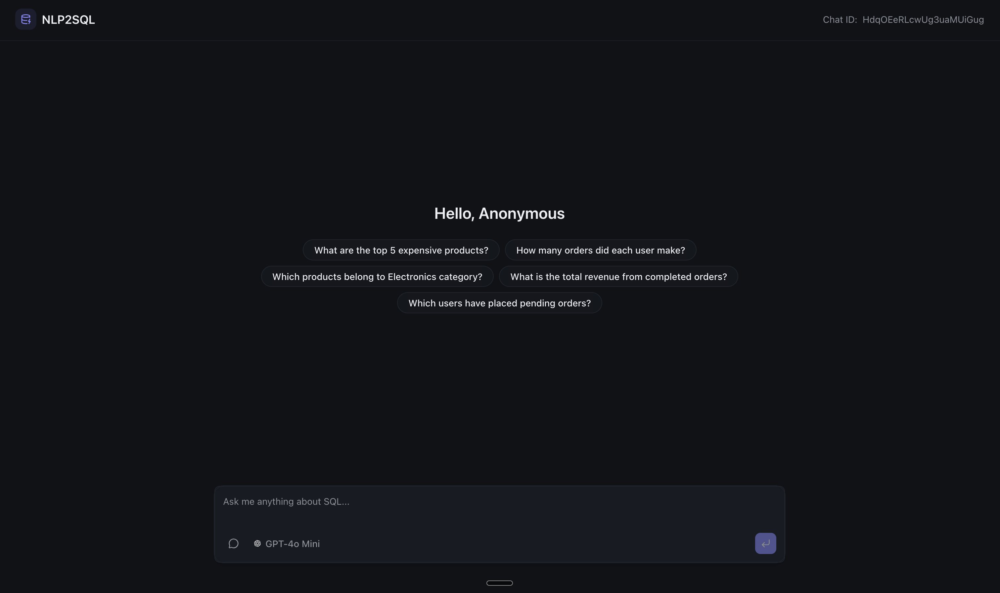
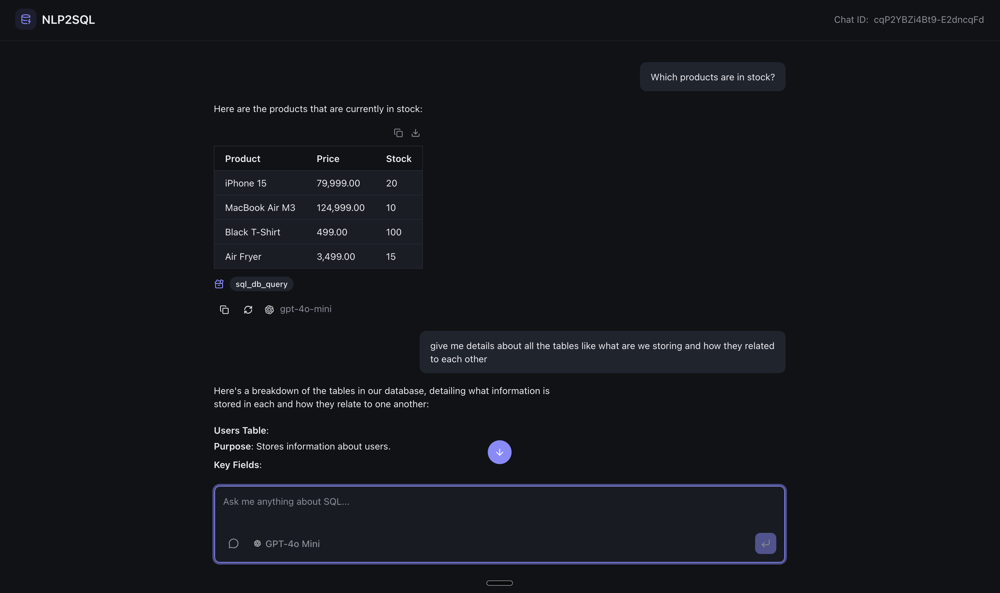

# NL2SQL

A FastAPI-based chat API for converting natural language queries to SQL using LangChain. This application provides an intuitive web interface where users can ask questions in natural language and receive SQL query results.

## Screenshots

### Chat Interface



The chat interface allows users to interact with the AI assistant, ask questions about the database, and receive formatted SQL query results.

## Tech Stack

### Frontend

- **React** - UI framework
- **Vite** - Build tool and dev server
- **Tailwind CSS** - Utility-first CSS framework
- **AI SDK** (`@ai`) - AI integration library for streaming responses
- **Shiki** - Syntax highlighting

### Backend

- **FastAPI** - Modern Python web framework
- **LangChain** - Framework for building LLM applications
- **OpenAI** (via `langchain-openai`) - AI model integration
- **PostgreSQL** (via `psycopg2-binary`) - Database connectivity
- **Uvicorn** - ASGI server

## API Endpoints

### POST `/api/v1/chat`

Streams AI responses for natural language to SQL conversion.

**Request Body:**
```json
{
  "message": "Which products are in stock?",
  "model": "gpt-4o-mini",
  "chat_id": "unique-chat-id"
}
```

**What it does:**
- Accepts natural language queries about the database
- Uses LangChain agents with SQL tools to generate and execute SQL queries
- Streams Server-Sent Events (SSE) with token-by-token AI responses
- Returns formatted results including tables, data, and SQL query information
- Supports multiple AI models (gpt-4o, gpt-4o-mini, gpt-3.5-turbo)

### GET `/api/v1/chat/suggestions`

Returns query suggestions based on the database schema.

**Response:**
```json
{
  "suggestions": [
    {
      "description": "What are the top 5 expensive products?",
    },
    ...
  ]
}
```

**What it does:**
- Analyzes the database schema to understand available tables and relationships
- Uses AI to generate 5 interesting and useful query suggestions
- All suggestions are read-only SELECT queries (no mutations)
- Helps users discover what they can ask about the database